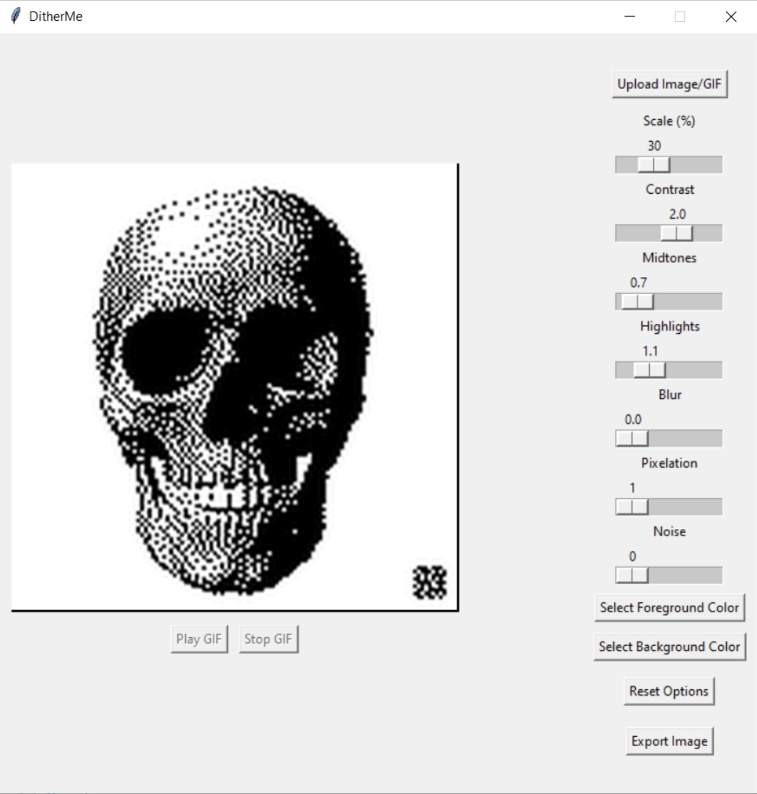
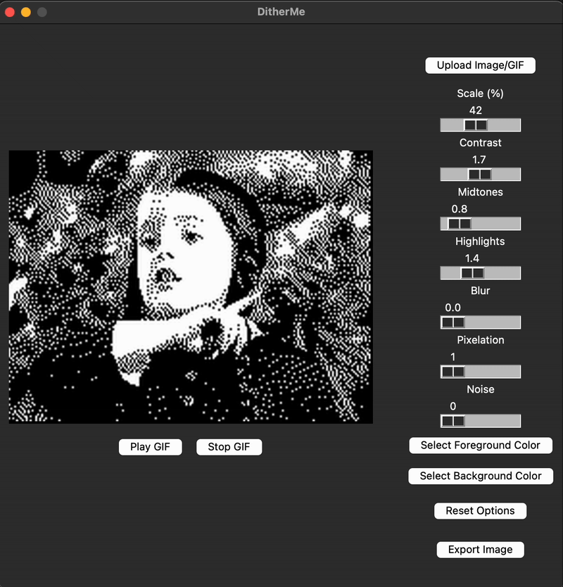

<h1 align="center">DitherMe - An .......</h1>

<p align="center">
    
    <a href="https://www.python.org/">
      
    </a>
      <a href="https://github.com/joshuavanderpoll/DitherMe/blob/main/LICENSE">
        
    </a>
    <a href="https://github.com/joshuavanderpoll/DitherMe/releases">
        
    </a>
</p>

## 📜 Description 
DitherMe is a Python-based image effect generator inspired by the iconic glitchy, dithered visuals seen in Watch Dogs 2's DedSec hacking sequences. It allows you to import and process images or GIFs, applying dithering effects with customizable settings, color palettes, pixelation, and noise controls.

### 🎨 Features:
- Dithering effects (Floyd-Steinberg algorithm)
- Custom color palettes for dithering
- GIF support – Play & process animated images
- Pixelation, contrast, blur, and noise filters
- Interactive sliders for real-time adjustments
- One-click exporting for processed images & GIFs

## 📚 Table of Contents
- 📜 [Description](#-description)
- ⚙️ [How to use](#️-how-to-use)
- 🖼 [Previews](#-previews)
- 💡 [Contribute](#-contribute)

## ⚙️ How to use

### Pre-compiled Executables
For convenience, we provide pre-compiled executables for various platforms. You can download them from the [releases page](https://github.com/joshuavanderpoll/DitherMe/releases).

#### Windows
1. Download the `DitherMe.exe` file.
2. Run the executable by double-clicking it.

#### macOS
1. Download the `DitherMe.dmg` file.
2. Open the `.dmg` file and drag the application to your Applications folder.
3. Run the application from the Applications folder.

### Running from Source
If you prefer to run the Python source code, follow the steps below:

> [!NOTE]
> To ensure a clean and isolated environment for the project dependencies, it's recommended to use Python's `venv` module.

#### iOS
```bash
git clone https://github.com/joshuavanderpoll/DitherMe.git
cd DitherMe
python3 -m venv .venv
source .venv/bin/activate
pip3 install -r requirements.txt
python3 DitherMe
```

#### Windows
```bash
git clone https://github.com/joshuavanderpoll/DitherMe.git
cd DitherMe
python -m venv .venv 
.venv\Scripts\activate
pip3 install -r requirements.txt
python3 DitherMe
```

## 🖼 Previews
<p align="center">
    
    
</p>

## 💡 Contribute
To contribute, first fork this repository, and `clone` it. Make your changes, whether you're fixing bugs, adding features, or improving translations. When done, `commit` your changes, `push` them, and submit a `pull request` for review to this repostiroy.

### Issues
If you're reporting an issue, make sure to include your `Python version` (python --version), and any relevant information.