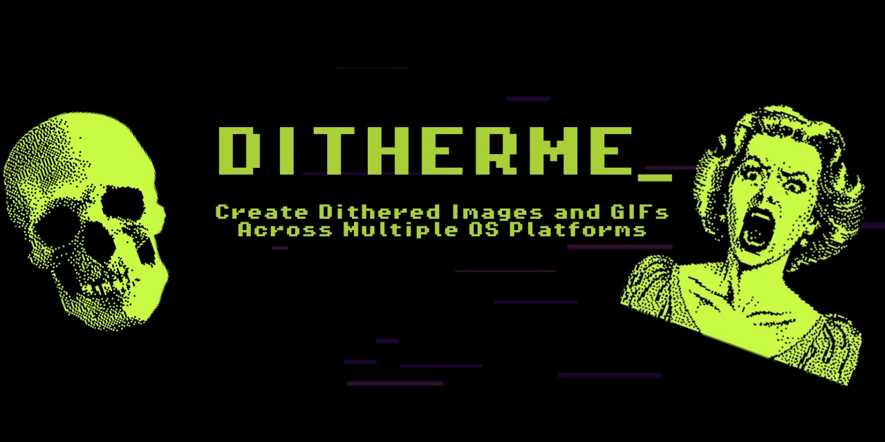
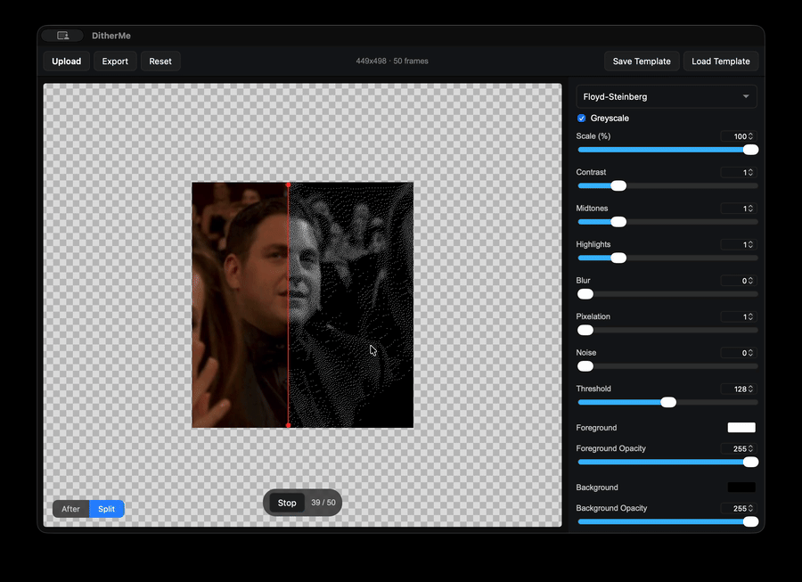

<p align="center">
  
</p>

<h1 align="center">DitherMe</h1>

<p align="center">
    <a href="https://tauri.app/">
      
    </a>
    <a href="https://www.rust-lang.org/">
      
    </a>
    <a href="https://svelte.dev/">
      
    </a>
    <a href="https://github.com/joshuavanderpoll/DitherMe/blob/main/LICENSE">
        
    </a>
    <a href="https://github.com/joshuavanderpoll/DitherMe/releases">
        
    </a>
</p>

DitherMe applies dithering effects to images and GIFs, the glitchy black-and-white look from Watch Dogs 2's DedSec hacks. It's a desktop app built with Tauri. The image pipeline and all dithering algorithms are written in Rust.

## Features

- 19 dithering algorithms (error diffusion, ordered, and pattern based)
- Foreground and background colors with separate opacity
- GIF playback and export
- Scale, contrast, midtones, highlights, blur, pixelation, noise, threshold
- Greyscale toggle, alpha preserved
- Live preview while dragging sliders (double-click a value to reset it)
- Zoom, pan, and trackpad pinch
- Save and load settings as JSON templates
- Export to PNG, JPEG, WebP, TIFF, BMP, ICO, and GIF

## Download

Grab a build for your platform from the [releases page](https://github.com/joshuavanderpoll/DitherMe/releases).

- Windows: run the `.msi` installer.
- macOS: open the `.dmg` and drag DitherMe to Applications.

## Build from source

You need Rust, Node.js, pnpm, and the [Tauri prerequisites](https://tauri.app/start/prerequisites/) for your OS.

```bash
git clone https://github.com/joshuavanderpoll/DitherMe.git
cd DitherMe
pnpm install

pnpm tauri dev      # run in development
pnpm tauri build    # build an installer
```

## Preview

<p align="center">
    
</p>

## Dithering algorithms

Error diffusion: Floyd-Steinberg, False Floyd-Steinberg, Sierra, Two-Row Sierra, Sierra Lite, Atkinson, Jarvis-Judice & Ninke, Stucki, Burkes, Lattice-Boltzmann, Stevenson-Arce, Knoll.

Ordered: Bayer 2x2, Bayer 4x4, Bayer 8x8, Clustered Dot 4x4.

Pattern: Checkered Small, Checkered Medium, Checkered Large.

## Project layout

- `crates/dither_core` - the Rust pipeline and dithering algorithms, no UI. Test with `cargo test -p dither_core`.
- `src-tauri` - Tauri shell and commands (open, process, export, templates).
- `src` - Svelte and TypeScript UI.
- `assets` - icon source and images.

## Contributing

See [CONTRIBUTING.md](CONTRIBUTING.md) for setup, commit conventions, and the pull request checklist. By participating you agree to the [Code of Conduct](CODE_OF_CONDUCT.md). To report a vulnerability, see [SECURITY.md](SECURITY.md).
