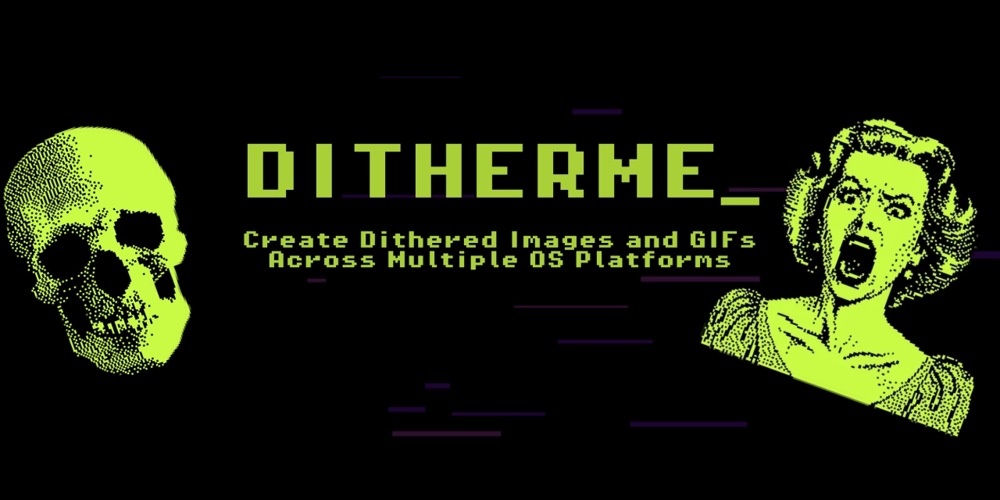
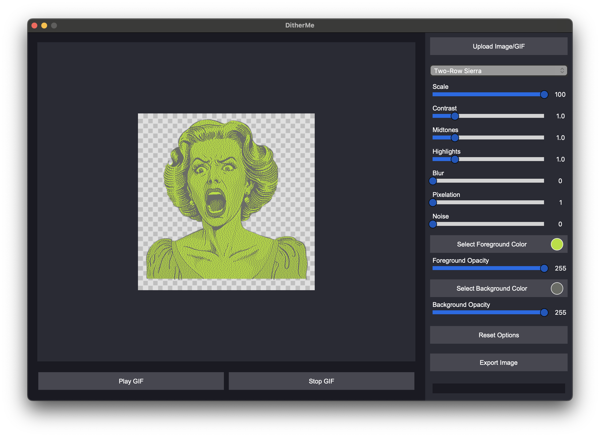

<p align="center">
  
</p>

<h1 align="center">DitherMe - Dither your images and GIFs</h1>

<p align="center">
    
    <a href="https://www.python.org/">
      
    </a>
      <a href="https://github.com/joshuavanderpoll/DitherMe/blob/main/LICENSE">
        
    </a>
    <a href="https://github.com/joshuavanderpoll/DitherMe/releases">
        
    </a>
    <a href="https://ditherme.joshua-server.nl?utm_source=github&utm_medium=readme&utm_id=ditherme" target="_blank">
        
    </a>
</p>

## 📜 Description 
DitherMe is a Python-based image effect generator inspired by the iconic glitchy, dithered visuals seen in Watch Dogs 2's DedSec hacking sequences. It allows you to import and process images or GIFs, applying dithering effects with customizable settings, color palettes, pixelation, and noise controls.

## 🎨 Features:
- 25+ Dithering algorithms
- Use custom colors for dithering
- Transparency support (PNG)
- GIF support – Play & process animated images
- Pixelation, contrast, blur, and noise filters
- Interactive sliders for real-time adjustments

## 📚 Table of Contents
- 📜 [Description](#-description)
- 🎨 [Features](#-features)
- ⚙️ [How to use](#️-how-to-use)
- 🖼 [Preview](#-preview)
- 🧙🏻 [Dithering Algorithms](#dithering-algorithms)
- 💡 [Contribute](#-contribute)

## ⚙️ How to use

### Pre-compiled Executables
For convenience, we provide pre-compiled executables for various platforms. You can download them from the [releases page](https://github.com/joshuavanderpoll/DitherMe/releases).

#### Windows
1. Download the `DitherMe.exe` file.
2. Run the executable by double-clicking it.

#### macOS
1. Download the `DitherMe.dmg` file.
2. Open the `.dmg` file and drag the application to your Applications folder.
3. Run the application from the Applications folder.

### Running from Source
If you prefer to run the Python source code, follow the steps below:

> [!NOTE]
> To ensure a clean and isolated environment for the project dependencies, it's recommended to use Python's `venv` module.

#### iOS
```bash
# Install repository
git clone https://github.com/joshuavanderpoll/DitherMe.git
cd DitherMe

# Setup Python environment
python3 -m venv .venv
source .venv/bin/activate
pip3 install -r requirements.txt

# Install PNG Lib
make clean
make 

# Compile and install all Dithering algorithms
python setup.py clean --all
pip install -e .

python3 DitherMe
```

#### Windows
```bash
# Install repository
git clone https://github.com/joshuavanderpoll/DitherMe.git
cd DitherMe

# Setup Python environment
python -m venv .venv
.venv\Scripts\activate
pip install -r requirements.txt

# Install PNG Lib
make clean
make

# Compile and install all Dithering algorithms
python setup.py clean --all
pip install -e .

python DitherMe
```

## 🖼 Preview
<p align="center">
    
</p>

## 🧙🏻 Dithering Algorithms:
- Error Diffusion Dithering (Error Correction)
  - Floyd-Steinberg
  - False Floyd-Steinberg
  - Sierra
  - Two-Row Sierra
  - Sierra Lite
  - Atkinson
  - Jarvis, Judice & Ninke
  - Stucki
  - Burkes
  - Lattice-Boltzmann
  - Stevenson-Arce
  - Knoll
- Ordered Dithering
  - Bayer (2x2)
  - Bayer 4x4
  - Bayer 8x8
  - Clustered Dot 4x4
- Pattern-Based Dithering
  - Checkers Small
  - Checkers Medium
  - Checkers Large
  - Radial Burst
  - Spiral
  - Vortex
  - Diamond
- Stochastic (Noise-Based) Dithering
  - Random
  - Blue Noise
  - Void-and-Cluster

## 💡 Contribute
To contribute, first fork this repository, and `clone` it. Make your changes, whether you're fixing bugs, adding features, or improving translations. When done, `commit` your changes, `push` them, and submit a `pull request` for review to this repostiroy.

### Issues
If you're reporting an issue, make sure to include your `Python version` (python --version), and any relevant information.